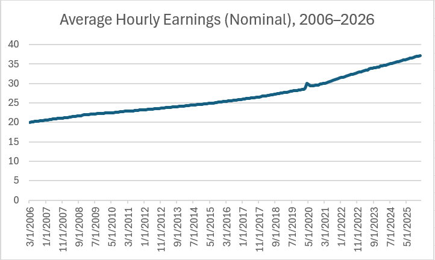

# Student Reality Lab — Wages vs Inflation

## Essential Question
Have wages kept up with inflation since 2006?

## Claim (Hypothesis)
Although nominal wages have increased since 2006, inflation-adjusted wages have grown much more slowly, meaning purchasing power has not increased at the same rate as wages.

## Audience
This project is intended for students and young adults who want to understand whether higher wages actually translate into greater purchasing power when the cost of living is rising.

# STAR Draft

## Situation
Many students hear that wages are increasing, but at the same time they experience rising costs for housing, groceries, transportation, and tuition. This creates confusion about whether people are actually better off financially.

## Task
The goal of this project is to determine whether wage growth has kept up with inflation since 2006. A viewer should be able to compare nominal wages and inflation-adjusted wages to understand how purchasing power has changed.

## Action
I built an interactive data story with two main views.

### View 1 — Wage Trend
A line chart shows wage growth over time with a toggle that allows the viewer to switch between:

- Nominal wages (actual wages at the time)
- Real wages (inflation-adjusted to 2006 dollars)

The chart includes an annotation highlighting the month with the lowest real wage in the dataset.

### Interaction
The viewer can toggle between nominal and real wages to see how inflation affects wage growth.

### View 2 — CPI Trend
A second chart shows how the Consumer Price Index (CPI) has changed over time. This helps explain why wages must be adjusted for inflation when analyzing purchasing power.

## Result
The data shows that nominal wages increased significantly between 2006 and today. However, after adjusting for inflation, the increase in real wages is much smaller.

This suggests that while wages have risen, purchasing power has not improved at the same pace because the cost of living has also increased.

# Dataset & Provenance

**Average Hourly Earnings**  
Series ID: CES0500000003  
Source: U.S. Bureau of Labor Statistics via FRED  
https://fred.stlouisfed.org/series/CES0500000003

**Consumer Price Index (CPI)**  
Series ID: CPIAUCSL  
Source: U.S. Bureau of Labor Statistics via FRED  
https://fred.stlouisfed.org/series/CPIAUCSL

Data retrieved: February 2026

# Data Dictionary

| Column | Meaning | Units |
|------|------|------|
| date | Month and year of observation | Date |
| nominal | Average hourly earnings | USD |
| cpi_clean.cpi | Consumer Price Index | CPI index |
| real | Inflation-adjusted wage | USD (2006 dollars) |

# Data Viability Audit

## Missing Values and Weird Fields
The CPI dataset originally contained missing or inconsistent values when merged with wage data. After merging datasets, the CPI values appeared under the field name `cpi_clean.cpi`, while the `cpi` field contained empty values.

## Cleaning Plan
- Merge wage and CPI datasets by date  
- Remove rows with missing CPI values  
- Calculate inflation-adjusted wages using 2006 as the base year  
- Export cleaned dataset as `processed.json`

# Draft Chart Screenshot

This draft chart was created in Excel during the early exploration phase of the project.

**Why this chart answers the question**

- The chart shows how wages change over time, allowing us to observe long-term trends in income growth.
- By comparing this wage trend with inflation data (CPI), we can determine whether wage increases actually translate into higher purchasing power.

## What This Dataset Cannot Prove
This dataset represents national averages and does not account for:

- regional wage differences  
- local cost of living variations  
- occupation-specific wage trends  
- housing or rent costs  

# Interaction Design
The application includes a toggle that allows the viewer to switch between nominal wages and inflation-adjusted wages. This interaction helps the viewer see how inflation changes the interpretation of wage growth.

# Views

**View 1 — Wage Trend**  
Interactive line chart with nominal vs real wage toggle.

**View 2 — CPI Trend**  
Line chart showing inflation changes over time.

# Key Insight
Nominal wages have increased steadily since 2006, but when adjusting for inflation, real wage growth is much smaller. This suggests increases in wages do not necessarily translate into greater purchasing power.

# Running the Project
- npm install 
- npm run dev

# Open in Browser
http://localhost:3000

# Limits & What I’d Do Next

This project focuses on national averages and does not account for regional differences or specific industries.

Future improvements could include:

- comparing wages by region  
- adding housing cost data  
- incorporating rent trends  
- adding filters for different time periods  

# Deployment

Live site: (add deployed URL)

Repository: https://github.com/laurasofia544/Student-Reality-Lab-Loaiza
